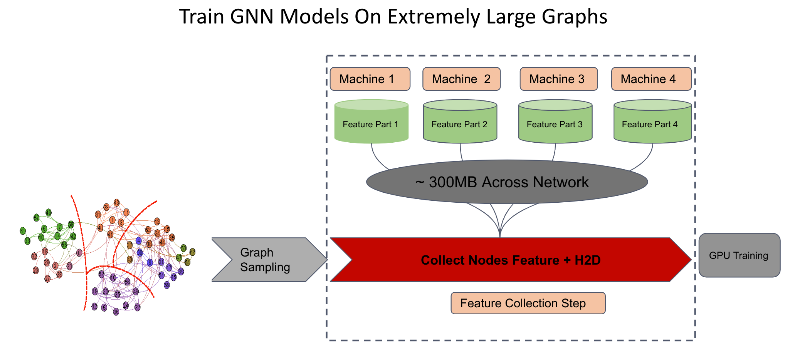

[pypi-image]: https://badge.fury.io/py/torch-geometric.svg
[pypi-url]: https://pypi.org/project/quiver-feature/

<p align="center">
  
</p>

--------------------------------------------------------------------------------

Quiver-Feature is a high performance component for **distributed feature collection** for **training GNN models on extreme large graphs**, It is build on [Quiver](https://github.com/quiver-team/torch-quiver) and RDMA network and has several novel features:

1. **High Performance**: Quiver-Feature has **5-10x throughput performance** over feature collection solutions in existing GNN systems such as DGL and PyG. 

2. **Maximum Hardware Resource Utilization Efficiency**: Quiver-Feature has minimum CPU usage and minimum memory bus traffic. Leaving much of the CPU and memory resource to graph sampling task and model training task.

3. **Easy to use**: To use Quiver-Feature, developers only need to add a few lines of code in existing PyG programs. Quiver-Feature is thus easy to be adopted by PyG users and deployed in production clusters.



--------------------------------------------------------------------------------
<!--Challenge
# Motivation 

GNN models are small and can be computed very fast on GPUs, but training GNN models on large graphs are often unbareable long due to the time-consuming feature collection step. For each iteration, GNN model may consume hundreds of MBs, even serveral GBs of feature data, making it very challenging to move these data across network, system memory and PCIe.


`DistTensorPGAS` is the key component Quiver-Feature provides. It places graph feature across devices(CPU DRAM, GPU HBM) and machines, trying to take full advantage of the multi-tier GPU-centric storage layers. During training, `DistTensorPGAS` uses **UVA** for local data access and **RDMA read** for remote data access, achieving E2E zero-copy and CPU/kernel bypass.
-->

# Performance Benchmark

`Quiver-Feature` uses RDMA for cross-machine data access, as far as we know, there's no public GNN system directly supports using RDMA for feature collection. `DGL` uses [TensorPipe](https://github.com/pytorch/tensorpipe) as its rpc backend, [TensorPipe](https://github.com/pytorch/tensorpipe) itself supports RDMA but `DGL` has not integrate this feature. Since [TensorPipe](https://github.com/pytorch/tensorpipe) is also the [official rpc backend](https://pytorch.org/docs/stable/rpc.html#torch.distributed.rpc.init_rpc) for Pytorch, so we compare the feature collection performance between`Quiver-Feature` and `Pytorch-RPC Based Solution`. 

We have 2 machines and 100Gbps IB networks between them. We partition the data uniformly and start M GPU training processes on each machine(which we will refer as `2 Machines 2M GPUs` in the following result chart). we benchmark feature collection performance of `Quiver-Feature` and `Pytorch-RPC Based Solution` and we can see that `Quiver-Feature` is 5x better over `Pytorch-RPC Based Solution` in all settings.


# Install

## Install From Source(Recommended For Now)
1. Install the Quiver pip package [from here](https://github.com/quiver-team/torch-quiver).

2. Install Quiver-Feature from source

        $ git clone git@github.com:quiver-team/$ quiver-feature.
        $ pip install .

## Pip Install

1. Install the [Quiver](https://github.com/quiver-team/torch-quiver).

2. Install the `Quiver-Feature` pip package.

    $ pip install quiver-feature

We have tested Quiver with the following setup:

 - OS: Ubuntu 18.04, Ubuntu 20.04

 - CUDA: 10.2, 11.1

 - GPU: P100, V100, Titan X, A6000

## Test Install

You can download Quiver-Feature's examples to test installation:

        $ git clone git@github.com:quiver-team/quiver-feature.git
        $ cd quiver-feature/examples/reddit
        $ python3 distribute_training.py 

A successful run should contain the following line:

`Starting Server With: xxxx`


# Quick Start

To use Quiver-Feature, you need to replace PyG's feature tensor with `quiver_feature.DistTensorPGAS`,this usually requires only a few changes in existing PyG programs with following 5 steps on each machine:

- Load feature partition and meta data which belongs to the current machine.

- Start a `quiver_feature.DistTensorServer` for serving current machine's feature partition.

- Exchange feature partition meta data using `quiver_feature.DistHelper`.

- Build a `quiver_feature.DistTensorPGAS` from local feature partition and meta data.

- Pass the `quiver_feature.DistTensorPGAS` built above as parameter to each training process for feature collection.

Here is a simple example for using Quiver-Feature in a PyG's program. You can check the [original scripts](examples/reddit/distribute_training.py) for more details.

```python
    
    def train_process(rank, dist_tensor):
        ...
        for batch_size, n_id, adjs in train_loader:
                ...
                # Using DistTensorPGAS for feature collection.
                collected_feature = dist_tensor[n_id]
                ...

    if __name__ == "__main__":
        # Step 1: Load Local data partition
        local_tensor, cached_range, local_range = load_partitioned_data(...)

        # Create DistHelper for information exchange and cross-process synchronization
        dist_helper = DistHelper(...)

        # Step 2: Exchange TensorPoints Information
        tensor_endpoints = dist_helper.exchange_tensor_endpoints_info()
        
        # Step 3: Start Feature Server
        server = threading.Thread(target=server_thread)
        server.start()


        # Step 4:  Build DistTensorPGAS from local feature partition
        ...

        dist_tensor = DistTensorPGAS(...)


        # Step 5: Spawn Training Processes Using DistTensor as Parameter

        mp.spawn(
                train_process,
                args=(..., dist_tensor, ...),
                nprocs=args.device_per_node,
                join=True
        )

```

# License

Quiver-Feature is licensed under the Apache License, Version 2.0

# Citation
If you use Quiver-Feature in your publication,please cite it by using the following BibTeX entry.

@Misc{Quiver-Feature,
  institution = {Quiver Team},
  title =  {Quiver-Feature:A High Performance Feature Collection Component For Distributed GNN Model Training},
  howpublished = {\url{https://github.com/quiver-team/quiver-feature}},
  year = {2022}
}