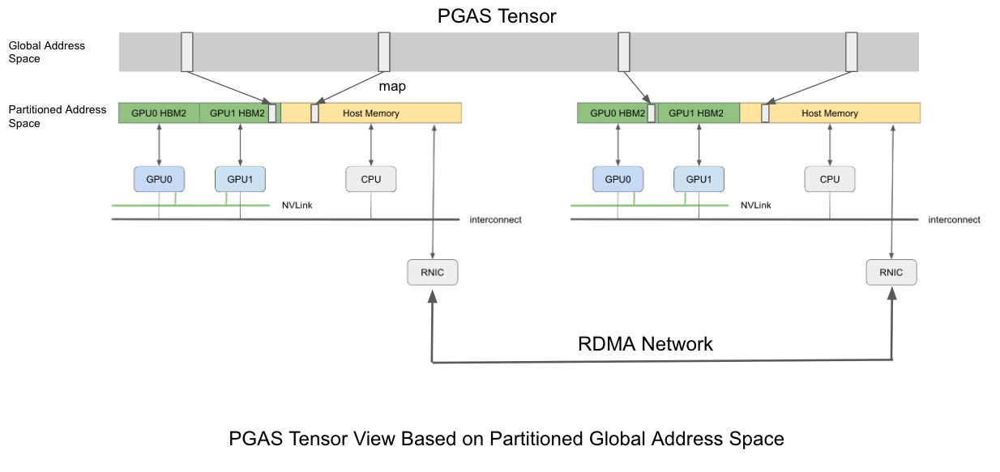

[pypi-image]: https://badge.fury.io/py/torch-geometric.svg
[pypi-url]: https://pypi.org/project/quiver-feature/

<p align="center">
  
</p>

--------------------------------------------------------------------------------

Quiver-Feature is a RDMA-based high performance **distributed feature collection component** for **training GNN models on extreme large graphs**, It is built on [Quiver](https://github.com/quiver-team/torch-quiver) and has several novel features:

1. **High Performance**: Quiver-Feature has **5-10x throughput performance** over feature collection solutions in existing GNN systems such as [DGL](https://github.com/dmlc/dgl) and [PyG](https://github.com/pyg-team/pytorch_geometric). 

2. **Maximum Hardware Resource Utilization Efficiency**: Quiver-Feature has minimum CPU usage and minimum memory bus traffic. Leaving much of the CPU and memory resource to tasks like graph sampling and model training.

3. **Easy to use**: To use Quiver-Feature, developers only need to add a few lines of code in existing PyG/DGL programs. Quiver-Feature is thus easy to be adopted by PyG/DGL users and deployed in production clusters.


--------------------------------------------------------------------------------

# Core Ideas

**GPU-centric data placement** and **Zero-Copy data access method** are two keys behind Quiver-Feature's high performance. 

**GPU-centric data placement:** Quiver-Feature has a unified view of memories across devices and machines. It classifies these memories into 4 memory spaces under a GPU-centric view:

- Local HBM: Local HBM is the memory space belongs to current GPU and has the best memory bandwidth(~600GB/s).

- Neighbor HBM: Neighbor HBMs are memories which belong to neighbor GPUs connecting with current GPU with NVLink.

- Local DRAM: Local DRAM is the CPU memory which belongs to current machine.

- Remote DRAM: Remote DRAM is CPU memory which belong to other machines.


These 4 memory spaces have connections with each other using PCIe, NVLink and RDMA etc. Accessing different memory spaces from a certain GPU has unbalanced performance(as show below). Considering that feature data access frequency during GNN training is also unbalanced, Quiver-Feature using application-aware and device topology aware data palcement algorithm to takes full advantage of the GPU-centric multi-level memories spaces.


**Zero-Copy data access method** Feature collection in GNN training involves massive data movement across network, DRAM, PCIe and NVLink and any extra memory copy hurts the e2e performance. Quiver-Feature use `UVA` for local memory spaces access(Local HBM, Local DRAM, Neighbor HBM) and use `RDMA READ` for remote memory space access(Remote DRAM), achiving zero-copy and minimum CPU intervention.([You can refer to this doc for our RDMA details](docs/rdma_details.md))

**Unified Distributed Tensor Abstraction** Above these memory spaces, Quiver-Feature adopts `Partitioned Global Address Space` and implements a 2-dimension distributed tensor abstraction which is called `DistTensorPGAS`. Users can use `DistTensorPGAS` just like a torch.Tensor, querying `shape`, `size` and do `slicing operation`.



Feature collection during GNN training is actually a slicing operation on `DistTensorPGAS` which needs to access data from both local and remote memory spaces. `DistTensorPGAS` use `UVA` for local access and `RDMA READ` for remote access, achieving e2e zero-copy and minimum CPU intervention.([You can refer to this doc for our RDMA details](docs/rdma_details.md))


# Performance Benchmark

As far as we know, there's no public GNN system directly supports using RDMA for feature collection. `DGL` uses [TensorPipe](https://github.com/pytorch/tensorpipe) as its rpc backend, [TensorPipe](https://github.com/pytorch/tensorpipe) itself supports RDMA but `DGL` has not integrate this feature. Since [TensorPipe](https://github.com/pytorch/tensorpipe) is also the [official rpc backend](https://pytorch.org/docs/stable/rpc.html#torch.distributed.rpc.init_rpc) of Pytorch, we compare the feature collection performance between`Quiver-Feature` and `Pytorch-RPC Based Solution`. 

We have 2 machines and 100Gbps IB networks between them. We partition the data uniformly and start M GPU training processes on each machine(which we will refer as `2 Machines 2M GPUs` in the following result chart). we benchmark feature collection performance of `Quiver-Feature` and `Pytorch-RPC Based Solution` and we can see that `Quiver-Feature` is 5x better over `Pytorch-RPC Based Solution` in all settings.


# Install

## Install From Source(Recommended For Now)
1. Install the Quiver pip package [from here](https://github.com/quiver-team/torch-quiver).

2. Install Quiver-Feature from source

        $ git clone git@github.com:quiver-team/quiver-feature
        $ pip install

## Pip Install

1. Install the [Quiver](https://github.com/quiver-team/torch-quiver).

2. Install the `Quiver-Feature` pip package.

    $ pip install quiver-feature

We have tested Quiver with the following setup:

 - OS: Ubuntu 18.04, Ubuntu 20.04

 - CUDA: 10.2, 11.1

 - GPU: P100, V100, Titan X, A6000

## Test Install

You can download Quiver-Feature's examples to test installation:

        $ git clone git@github.com:quiver-team/quiver-feature.git
        $ cd quiver-feature/examples/reddit
        $ python3 distribute_training.py 

A successful run should contain the following line:

`Starting Server With: xxxx`


# Quick Start

To use Quiver-Feature, you need to replace PyG's feature tensor with `quiver_feature.DistTensorPGAS`,this usually requires only a few changes in existing PyG programs with following 4 steps on each machine:

- Load feature partition and meta data which belongs to the current machine.

- Exchange feature partition meta data with other processes using `quiver_feature.DistHelper`.

- Create a `quiver_feature.DistTensorPGAS` from local feature partition and meta data.

- Pass the `quiver_feature.DistTensorPGAS` built above as parameter to each training process for feature collection.

Here is a simple example for using Quiver-Feature in a PyG's program. You can check the [original scripts](examples/reddit/distribute_training.py) for more details.

```python
    
    def train_process(rank, dist_tensor):
        ...
        for batch_size, n_id, adjs in train_loader:
                ...
                # Using DistTensorPGAS Just Like A torch.Tensor
                collected_feature = dist_tensor[n_id]
                ...

    if __name__ == "__main__":

        # Step 1: Load Local data partition
        local_tensor, cached_range, local_range = load_partitioned_data(...)

        # Step 2: Exchange TensorPoints Information
        dist_helper = DistHelper(...)
        tensor_endpoints = dist_helper.exchange_tensor_endpoints_info()

        
        # Step 3:  Build DistTensorPGAS from local feature partition
        dist_tensor = DistTensorPGAS(...)


        # Step 4: Spawn Training Processes Using DistTensor as Parameter
        mp.spawn(
                train_process,
                args=(..., dist_tensor, ...),
                nprocs=args.device_per_node,
                join=True
        )
        ...

```

# License

Quiver-Feature is licensed under the Apache License, Version 2.0

# Citation
If you use Quiver-Feature in your publication,please cite it by using the following BibTeX entry.

    @Misc{Quiver-Feature,
        institution = {Quiver Team},
        title =  {Quiver-Feature:A High Performance Feature Collection Component For Distributed GNN Model Training},
        howpublished = {\url{https://github.com/quiver-team/quiver-feature}},
        year = {2022}
    }