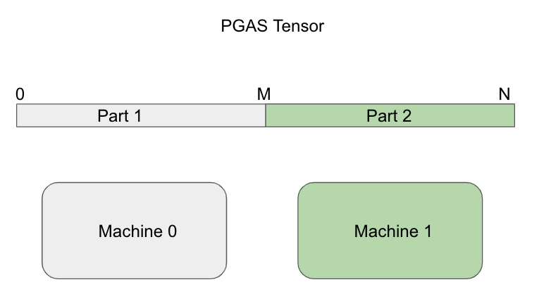

# Peak Memory Footprint Optimization In Quiver-Feature

By default, Quiver-Feature use `range partition` method to partition original gaint feature array onto different machines. This is pretty easy to understand, let's talk more about memory usage in each machine.

On each machine:
1. The feature tensor needs to be pinned so that RNIC and GPU can access its memory directly.

2. The feature tensor should be in SHM because multiple processes needs to access its data.

Pinning memory doesnt consume extra memory but moving a torch.Tensor to SHM will cause 
2x the peak memory of the original data size.

To solve this problem, we implement `quiver_feature.shared_load` to replace the original `torch.load`. `quiver_feature.shared_load` is almost the same as `torch.load` except that it loads data directly into SHM. So the peak memory during creating `DistTensorPGAS` will be around the original data size, **half of that when using torch.load**.

You can check our [test script](../tests/python/test_SharedLoader.py) for more details.

