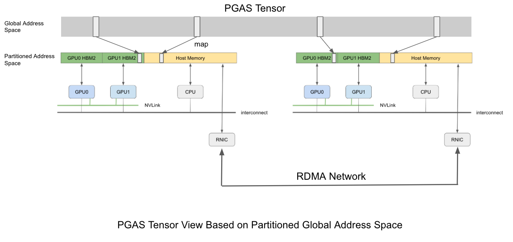
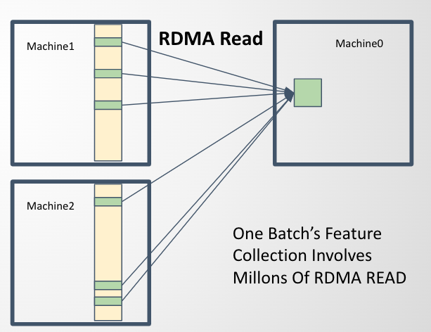
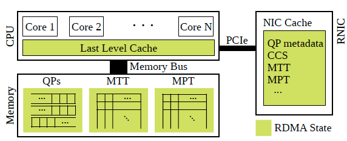

# RDMA Details

This doc will mainly describe how we use RDMA for remote data access and summarize techniques we use to get the best RDMA performance. 

Before we start, we would like to show our appreciation to [@claudebarthels](https://github.com/claudebarthels) for developing [infinity](https://github.com/claudebarthels/infinity) which is a lightweight C++ RDMA library for IB and is also the code base for our RDMA implementation.

## Use RDMA READ for Feature Collection

As we mentioned in the [REAMDE](../README.md), `quiver_feature.DistTensorPGAS` is a 2-dimension distributed tensor abstraction above different memory spaces using `PGAS` model(Partitioned Global Address Space) and **`quiver_feature.DistTensorPGAS` is splitted by row and is placed on different machines**. When we want to access a certain row of `quiver_feature.DistTensorPGAS`, **we can compute the target machine's index and the memory offset of this row on that target machine from row index**. Since each row's data size can be known in advance, **we can use one single `RDMA READ` to fetch this wanted row's data(which corresponds to a single node's feature)**.

So **each batch's feature collection involves millons of `RDMA READ`**, each `READ` for one node's feature.

## 4 Techniques We Use
Feature collection invloves millions of small `RDMA READs`(each `READ` may read just 2KB data), and we use these 3 techniques to get the best performance.

### Rule 1: Use Multi QPs Per Client

RDMA hosts use Queue Pair(QP) to communicate with each other. Nowadays, RNICs contains a pool of processing units(PUs) and we believe that requests in the same QP is always processed by the same PU to avoid cross-PU synchronization. But CPU is much powerful than a PU so if we only use one QP per RDMA client, the performance can be easily bottlenecked by the PU's ability. So we use multi QPs per RDMA client and dispatch READ requests evenly to these QPs to take full advantage of RNIC's parallel processing ability.

### Rule 2: Only Set A Subset Of All Requests as Signaled

Each RDMA read request can be set as signaled or unsignaled. <!--A CQE(Completion Query Entry) will be put into CQ(Completion Queue) if a signaled read request is completed and CPU can poll from CQ to check the status of this request.-->Signaled requests need CPU intervention but users can check result status by polling CQs(Completion Queue). Unsignaled requests dont involve CPU, but users have to decide their own way to check if these requests are completed successfully.

Like we said before, each batch's feature collection involves millions of `RDMA READ` requests. For each QP, we sequentially send these requests but only set one request out of `CQ_MOD`(which we often set as 128) requests as signaled, i.e. we only set 1/128 of all requests as signaled and check their result status. We also set the last request as signaled and wait until its completion to make sure that all requests in this QP are completed. If these signaled requests' result status are all succefful, we think all requests are completed sucessfully.

## Set QP's max_rd_atomic as the RNIC's max_qp_rd_atom

`max_rd_atomic` is a crucial QP attribute for performance, it is the number of RDMA Reads & atomic operations outstanding at any time that can be handled by a RC QP as an initiator. We suggest you set it as RNIC's `max_qp_rd_atom` which you can get by calling `ibv_query_device()`. You can refer to [our code](https://github.com/quiver-team/quiver-feature/blob/main/csrc/include/infinity/queues/QueuePair.cpp#L38) to see how to set this attribute.

## Reduce Address Translation Overhead

RNIC uses DMA to access system memory, since DMA can only handle physical addresses, the memory region which is exposed to RNIC must be registered so that RNIC stores virtual-to-physical mapping of this memory region in its MTT(Memory Translation Table). MTT is stored in system memory but RNIC's SRAM will cache some. Every time RNIC receive a RDMA read/write requests, it will first translate user's virtual address to physical address by looking up it's MTT cache, if the cache is missed, it will send requsts through PCIe to check this mapping in system memory which may bring severe overhead and thus cause RDMA performance degradation.

To reduce this address translation overhead, we choose to sort our requested node ids before sending RDMA requests to increase memory accessing locality so that RNIC's cache could get higher hit rate.

