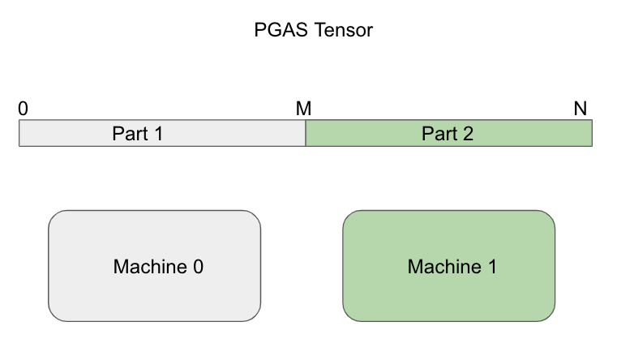

# Introduction

Distributed training setting on MAG240M dataset is almost the same as the [official example in DGL](https://github.com/dmlc/dgl/tree/master/examples/pytorch/ogb_lsc/MAG240M) except that we use `Quiver-Feature` for distributed feature collection.

Our implementation is much faster than DGL's offical example while achieved similar accuracy.

# Data Preprocess & Partition

First, please run [preprocess.py](./preprocess.py) to generate `graph.dgl` and `full.npy`, you can check [DGL's official guide](https://github.com/dmlc/dgl/tree/master/examples/pytorch/ogb_lsc/MAG240M) for more details.

Then we use [Range Partition](../../docs/partition_methods.md) to partition feature data, it is very easy to understand, you can check [process_quiver.py](./process_quiver.py) for more details.

# Running Training Script

On each machine, please run:

    python3 distributed_training.py \
            --rootdir . \
            --graph-path ./graph.dgl \
            --feature-partition-path ./feature_part.pt \
            --server_world_size 2
            --server_rank 0

Remember to:

- Set shm size limit as large as your physical memory size. You can set by:

        sudo mount -o remount,size=300G /dev/shm

- Set `MASTER_IP` as your master node's IP

The validation accuracy is 0.680. We do not have ground truth test labels so we do not report test accuracy.

# Performance

With 2 machines and 1 GPU per machine, we need 2 minutes 10 seconds to train and 15 seconds to validate for each epoch. This is 3x faster than [DGL's performance result](https://github.com/dmlc/dgl/tree/master/examples/pytorch/ogb_lsc/MAG240M).

# Hardware configurations

We have 2 machines, each have 377G memory and they are connected by 100Gbps IB. Running training script will consume around 256GB memory.
